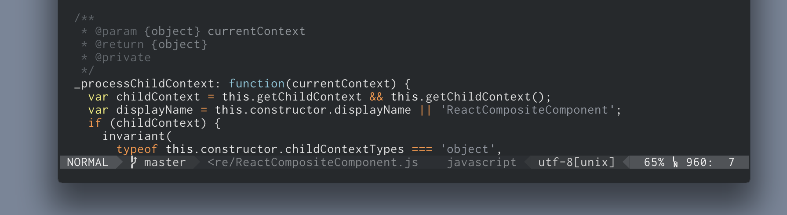
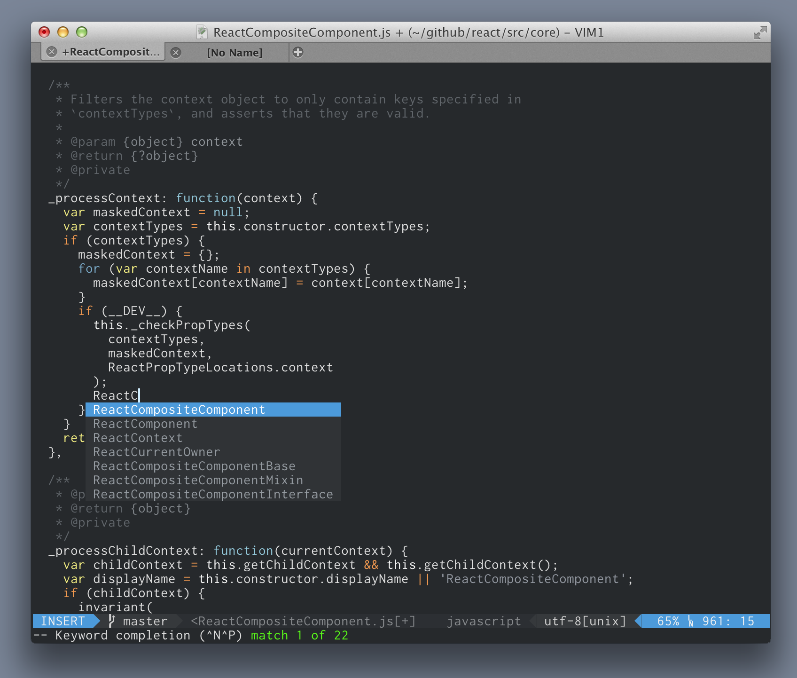
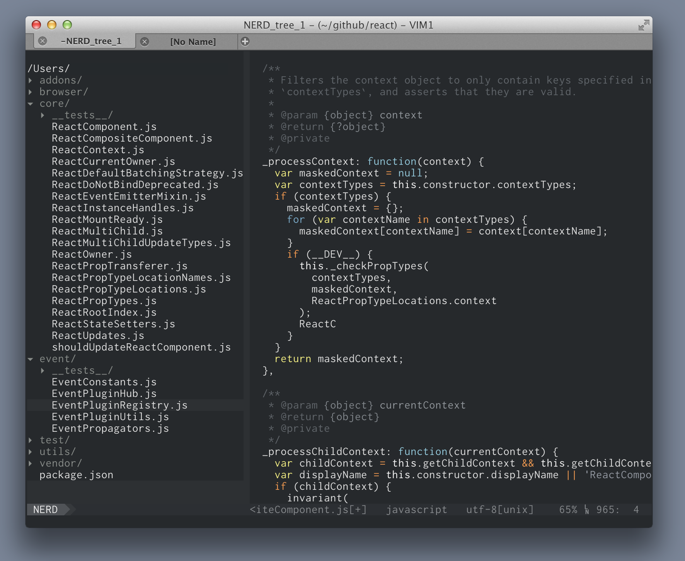

flatlandia
==========

Vim colorscheme based on flatland with Airline integration. Based on the excellent https://github.com/thinkpixellab/flatland

- Flatlandia is even flatter than flatland.
- Flatlandia also includes a matching `vim-airline` theme.
- JSDoc comment highlighting.
- Flatlandia sometimes deviates from flatlands choice of colors.

**Installation**

- If you want airline support, ensure that that `airline` is installed, then install `flatlandia` (this plugin) using `Vundle` or `NeoBundle`.

        " Using Vundle
        Bundle 'bling/vim-airline'
        Bundle 'jordwalke/flatlandia'

        " Or if using NeoBundle(recommended)
        NeoBundle 'bling/vim-airline'
        NeoBundle 'jordwalke/flatlandia'

- To install the application icon, open the `.icns` file in Mac Preview, click on the image and select all (`CMD+a`). Find MacVim in `/Applications`, click once on it and press `CMD+i`. Click on the little icon in that info window, then hit `CMD+v`. Restart MacVim.

**Application Icon**

**Airline**

**Completion**

**Nerd Side Bar**

**Support**

Only tested on MacVim, but probably works in other environments. Please send pull requests for 256 terminal support.
